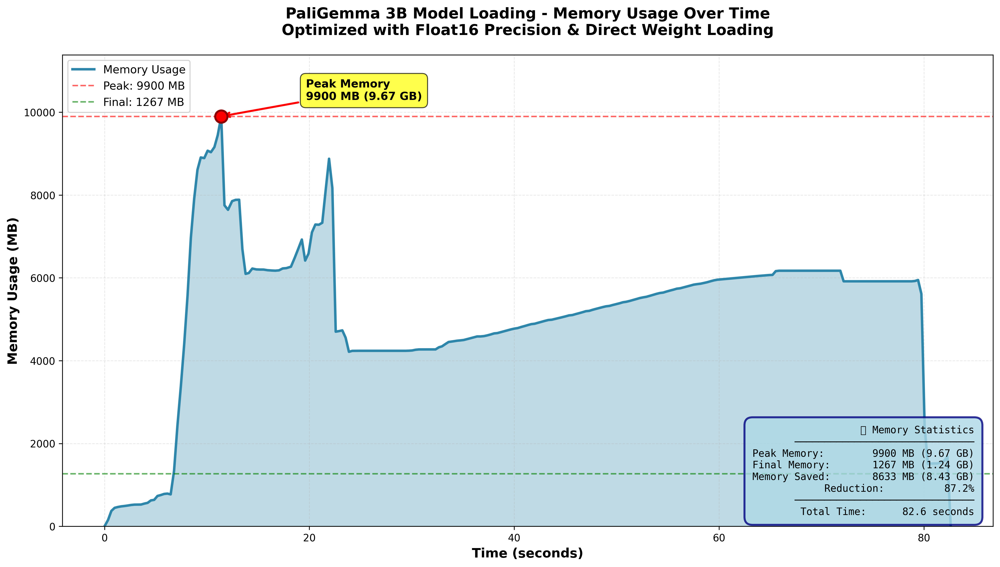

# pytorch-paligemma (Memory-Optimized Fork)

This is a fork of the original PaliGemma PyTorch implementation with **significant memory optimizations** to enable running the model on systems with limited RAM.

## 🚀 Key Improvements

### Memory Optimization
The original implementation required excessive RAM (~22GB+) to load the 3B parameter model, causing Out-of-Memory (OOM) errors on most consumer hardware. This fork implements several optimizations:

1. **Meta Device Loading**: Model structure is created on `torch.device('meta')` without allocating memory initially
2. **Direct Weight Loading**: Weights are loaded directly into model parameters without creating an intermediate dictionary, avoiding duplicate memory allocation
3. **Float16 Precision**: Model runs entirely in float16, reducing memory by ~50% compared to float32
4. **Incremental Loading**: Each weight shard is loaded, copied, and freed immediately to minimize peak memory
5. **Proper Buffer Initialization**: Fixes uninitialized position_ids buffers that occur when using meta device loading

### Result
- **Before**: ~22GB+ peak RAM (model failed to load on 13GB RAM systems)
- **After**: ~10GB peak RAM, ~6GB final model size
- **Memory reduction: ~65% savings**



*Real-time memory usage during model loading showing peak at ~9.9GB during loading and final steady state at ~5.9GB*

Works on systems with:
- 12GB RAM (with some swap)
- 16GB RAM (comfortably, no swap needed)

## 📋 Requirements

```bash
pip install -r requirements.txt
```

Minimum system requirements:
- 12GB RAM + 4GB swap (or 16GB+ RAM recommended)
- CPU or CUDA-capable GPU

## 🔧 Setup

1. Clone this repository:
```bash
git clone https://github.com/23Tarandeep57/pytorch-paligemma.git
cd pytorch-paligemma
```

2. Install dependencies:
```bash
pip install -r requirements.txt
```

3. Download the PaliGemma model weights using Git LFS:
```bash
# Install Git LFS if not already installed
sudo apt-get install git-lfs  # On Ubuntu/Debian
# or
brew install git-lfs  # On macOS

# Clone the model repository
git lfs install
git clone https://huggingface.co/google/paligemma-3b-pt-224
```

## 🚀 Usage

Run inference using the provided script:

```bash
bash launch_inference.sh
```

Or run directly with Python:

```bash
python inference.py \
    --model_path /path/to/paligemma-3b-pt-224 \
    --prompt "describe this image" \
    --image_file_path test_images/your_image.jpg \
    --max_tokens_to_generate 100 \
    --temperature 0.8 \
    --top_p 0.9 \
    --do_sample False \
    --only_cpu True
```

## 🛠️ Technical Details

### Memory Optimization Implementation

The key changes are in `utils.py`:

```python
# Step 1: Create model on meta device (no memory allocation)
with torch.device('meta'):
    model = PaliGemmaForConditionalGeneration(config)

# Step 2: Materialize model in float16
model = model.to_empty(device='cpu')
for name, param in model.named_parameters():
    param.data = param.data.half()  # Convert to float16

# Step 3: Load weights DIRECTLY into model (no intermediate dict)
state_dict = model.state_dict()
for safetensors_file in safetensors_files:
    with safe_open(safetensors_file, framework="pt", device="cpu") as f:
        for key in f.keys():
            if key in state_dict:
                tensor = f.get_tensor(key)
                if tensor.dtype == torch.float32:
                    tensor = tensor.half()
                
                # Direct copy - no duplicate memory!
                state_dict[key].copy_(tensor)
                del tensor  # Free immediately

# Step 4: Fix uninitialized buffers from meta device
for name, module in model.named_modules():
    if hasattr(module, 'position_ids') and hasattr(module, 'num_positions'):
        module.register_buffer(
            "position_ids",
            torch.arange(module.num_positions, device=device).expand((1, -1)),
            persistent=False,
        )
```

**Why this is efficient:**
- No intermediate `tensors = {}` dictionary (saves 6GB)
- Weights are copied directly into model parameters using `.copy_()`
- Each weight is freed immediately after copying
- Peak memory = model size (6GB) + one shard being loaded (~4GB) = ~10GB

**Memory timeline:**
1. Meta device: 0GB
2. Create empty float16 model: 6GB
3. Load shard 1 + copy: ~10GB peak
4. After copy, free shard: back to 6GB
5. Repeat for remaining shards
6. Final: 6GB model in float16

## 🐛 Known Issues

- Model runs on CPU by default for maximum compatibility
- Inference is slower on CPU compared to GPU
- Float16 may have minor precision differences compared to float32 (negligible for most use cases)
- Some minor precision differences may occur due to float16 conversion


## �🙏 Acknowledgments

- Original PaliGemma implementation
- Google Research for the PaliGemma model
- HuggingFace for the model hosting and transformers library

## 🔗 Links

- Original Repository: https://github.com/hkproj/pytorch-paligemma
- PaliGemma Model: https://huggingface.co/google/paligemma-3b-pt-224
- Paper: https://arxiv.org/abs/2407.07726